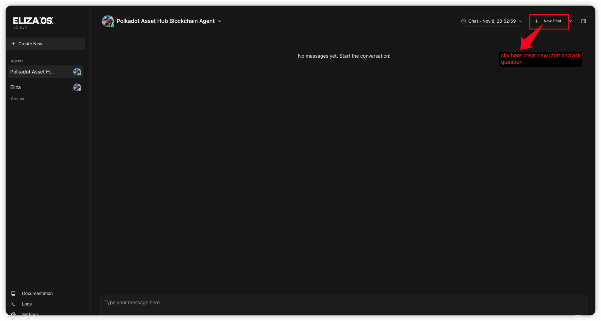
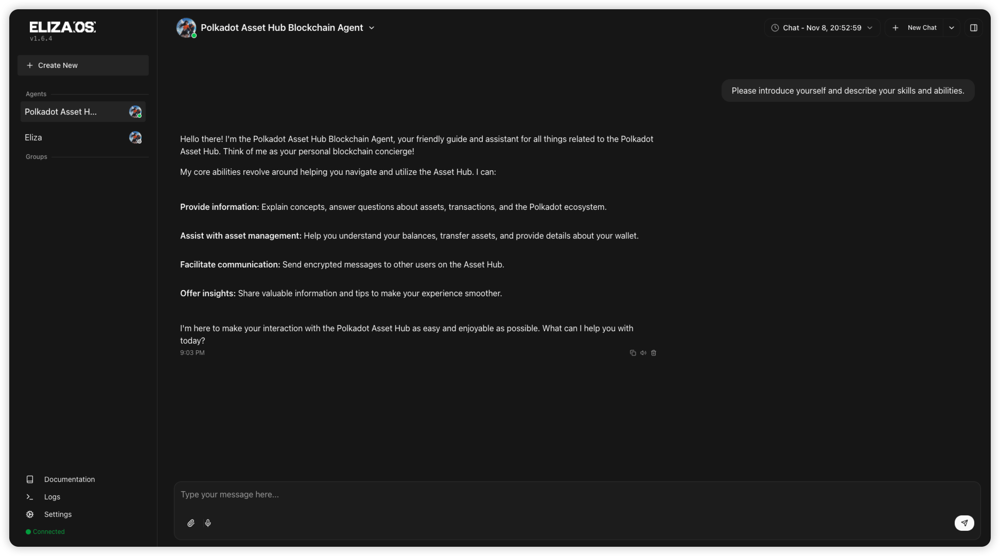
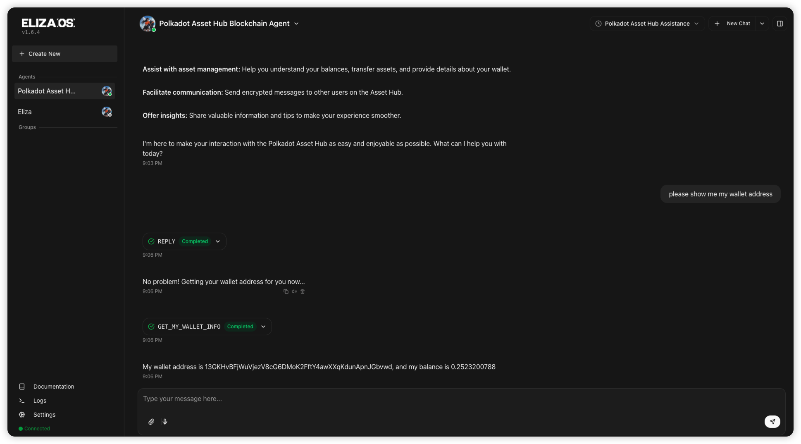
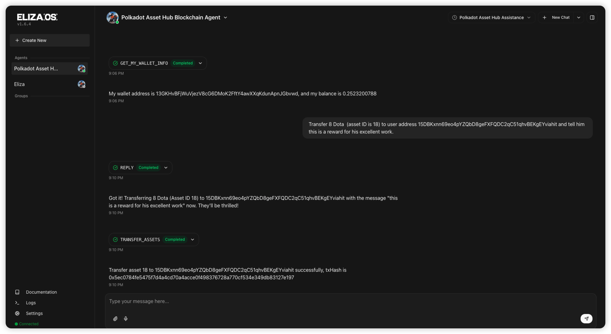

# Eliza-Polkadot-Assethub-AI-Agent

An AI agent bundled with the `@chainsupport/eliza-polkadot-assethub` plugin. Use this project to exercise every feature provided by `@chainsupport/eliza-polkadot-assethub`, and to give users a working ElizaOS example that demonstrates how to integrate this plugin so they can make better use of it.

## Configure Your Environment

### Environment Requirements

#### Local (if you run the agent on your machine)
1. [node](https://nodejs.org/en/download) version v23.3.0 (or version >= v23.3.0)
2. [bun](https://bun.com/docs/installation) latest release

#### Docker (if you run the agent in Docker)
No additional requirements

<!-- ### Create the `.env` file

```
git clone https://github.com/ChainSupport/eliza.git
cd eliza
cp .env.example.env .env
```

Then set the variables below in `.env`:

```
OPENROUTER_API_KEY=
OPENAI_API_KEY=
ASSET_HUB_PRIVATE_KEY=
```

Run the command below to load the variables into your current shell session:

```
export $(grep -v '^#' .env | xargs)
``` -->

### Run the Agent (choose one option)
```
git clone https://github.com/ChainSupport/eliza.git
cd eliza
```
#### 1. Run locally

Create the `.env` file
```
cp .env.example.env .env
```
Then set the variables below in `.env`:

```
OPENROUTER_API_KEY=
OPENAI_API_KEY=
ASSET_HUB_PRIVATE_KEY=
```

Install the ElizaOS CLI globally:
```
bun install -g @elizaos/cli
```

Start the agent:
```
elizaos start
```

#### 2. Run with Docker
Set the variables below in `docker-compose.yaml`:

```
OPENROUTER_API_KEY=
OPENAI_API_KEY=
ASSET_HUB_PRIVATE_KEY=
```

```
docker-compose up --build
```

### Interact with the Polkadot Asset Hub Agent

Visit [http://localhost:3000/](http://localhost:3000/)

Create a new chat and start asking questions:



#### Example Questions

1. Ask about the agent’s abilities:


2. Retrieve wallet information:


3. Submit a transfer with an encrypted memo:


> View the transfer details: [https://assethub-polkadot.subscan.io/extrinsic/0x5ec0784fe5475f7d4a4cd70a4acce0f498376728a770cf534e349db83127e197](https://assethub-polkadot.subscan.io/extrinsic/0x5ec0784fe5475f7d4a4cd70a4acce0f498376728a770cf534e349db83127e197)

## License

This project is licensed under the Apache License 2.0. See the `LICENSE` file for details.
