### Environment Requirements

#### Local (if you run the agent on your machine)
1. [node](https://nodejs.org/en/download) version v23.3.0 (or version >= v23.3.0)
2. [bun](https://bun.com/docs/installation) latest release

#### Docker (if you run the agent in Docker)
No additional requirements

### Run the Agent (choose one option)
```
git clone https://github.com/ChainSupport/eliza.git
cd eliza
```
#### 1. Run locally

Create the `.env` file
```
cp .env.example.env .env
```
Then set the variables below in `.env`:

```
OPENROUTER_API_KEY=
OPENAI_API_KEY=
ASSET_HUB_PRIVATE_KEY=
```
Install the ElizaOS CLI globally:
```
bun install -g @elizaos/cli
```

Start the agent:
```
elizaos start
```

#### 2. Run with Docker
Set the variables below in `docker-compose.yaml`:

```
OPENROUTER_API_KEY=
OPENAI_API_KEY=
ASSET_HUB_PRIVATE_KEY=
```

```
docker-compose up --build
```

### Manual Testing

#### 1. GET_MY_WALLET_INFO (get-my-wallet-info.ts)
  input:
  ```
  Get my wallet info
  ```
  output:
  ```
  My wallet address: 13GKHvBFjWuVjezV8cG6DMoK2FftY4awXXqKdunApnJGbvwd
  Native DOT balance: 0.1669384548
  Account URL: https://assethub-polkadot.subscan.io/account/13GKHvBFjWuVjezV8cG6DMoK2FftY4awXXqKdunApnJGbvwd
  ```
  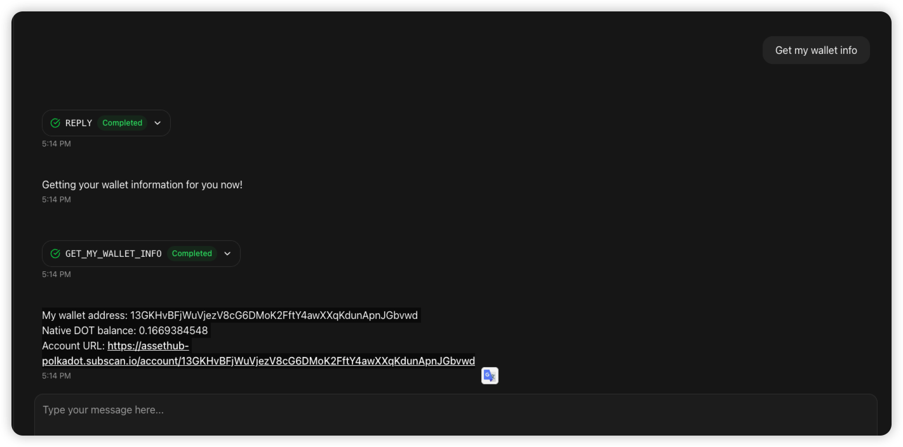
  Here, we get our wallet address and on-chain balance, test passed.

#### 2. USER_ASSETS_BALANCE （address-assets-balance.ts）
##### 1. Query DOT
  input:
  ``` 
  Get my wallet's native DOT balance
  ```
  output:
  ```
  My Native DOT balance on the Polkadot AssetHub is 0.1669384548
  Account URL: https://assethub-polkadot.subscan.io/account/13GKHvBFjWuVjezV8cG6DMoK2FftY4awXXqKdunApnJGbvwd
  ```
  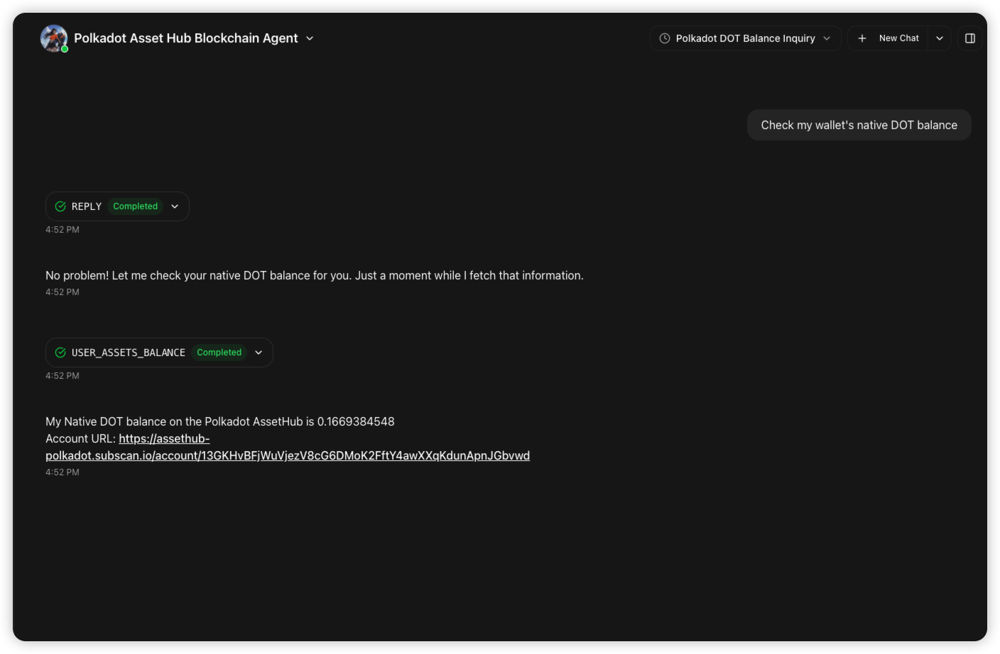
  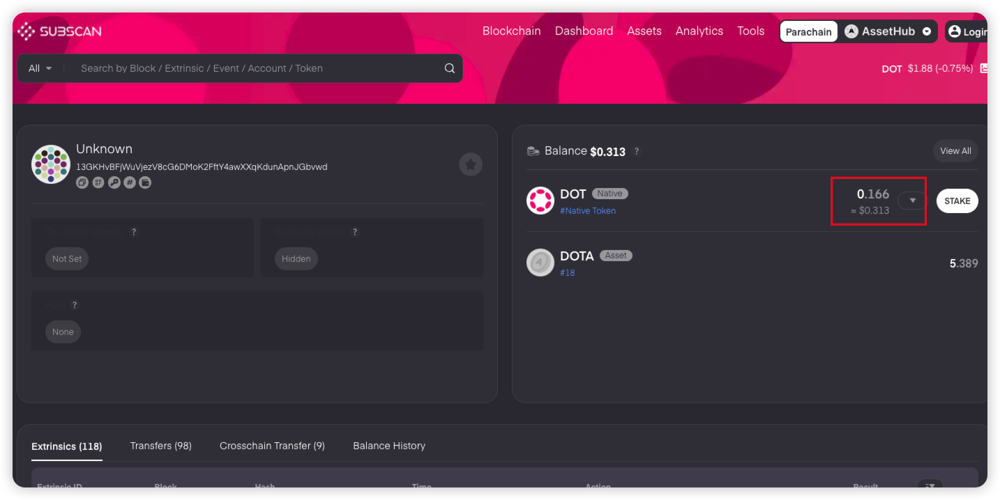
  Here, we can see that the Native DOT balance displayed in the eliza agent matches subscan, test passed.
##### 2. Query Multi-Asset (DOTA)
  input:
  ```
  show my DOTA asset balance
  ```
  output:
  ```
  My Asset 18 balance on the Polkadot AssetHub is 5.3898
  Account URL: https://assethub-polkadot.subscan.io/account/13GKHvBFjWuVjezV8cG6DMoK2FftY4awXXqKdunApnJGbvwd
  ```
  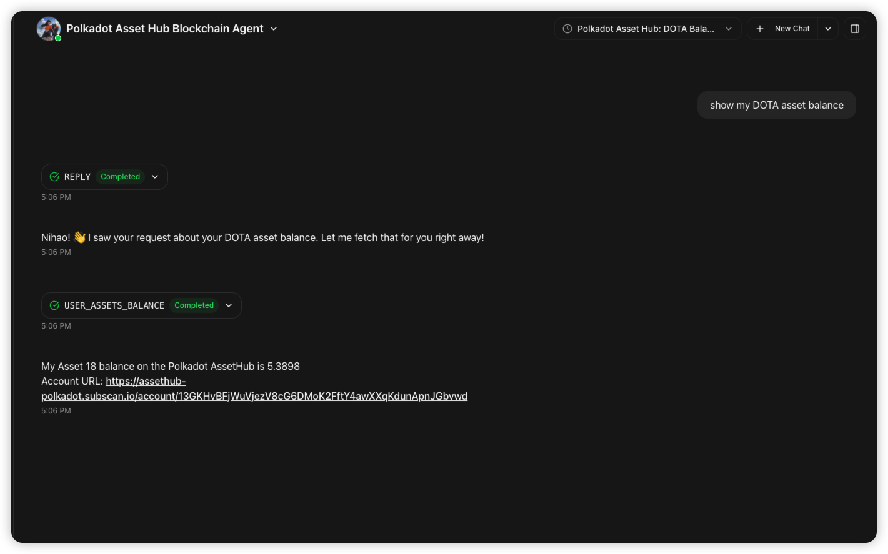
  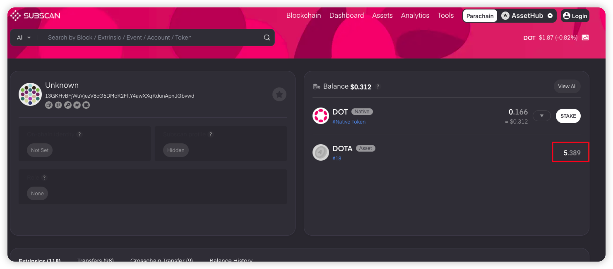
  Here, we can see that the DOTA balance displayed in the eliza agent matches subscan, test passed.

##### 3. Query Balance of an Invalid Address (Address Format Error)
input:
```
Get ddDBKxnn69eo4pYZQbD8geFXFQDC2qC51qhvBEKgEYviahit native DOT balance
```
output:
```
Invalid address or assetId: ddDBKxnn69eo4pYZQbD8geFXFQDC2qC51qhvBEKgEYviahit, null
```
Query failed as expected. Test passed.

#### 3. TRANSFER_ASSETS (assets-transfer.ts)

##### 1. Transfer DOT
  input:
  ```
  Transfer 0.01 DOT to address 15DBKxnn69eo4pYZQbD8geFXFQDC2qC51qhvBEKgEYviahit
  ```
  output:
  ```
  Transfer Native DOT to 15DBKxnn69eo4pYZQbD8geFXFQDC2qC51qhvBEKgEYviahit successfully.
  Tx's id: 0x43c3da59fdc72082a42452459de1e8c37b93e1f968dbaf4d33631ec339794d82
  Extrinsic URL: https://assethub-polkadot.subscan.io/extrinsic/0x43c3da59fdc72082a42452459de1e8c37b93e1f968dbaf4d33631ec339794d82
  ```
  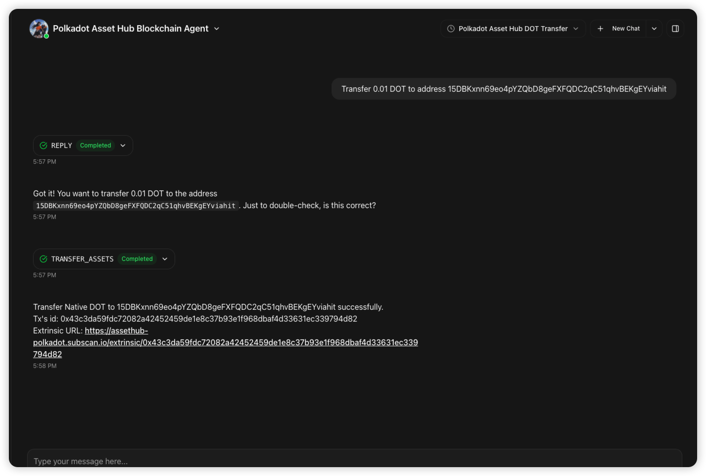
  Click `Extrinsic URL` to view the transaction on subscan
  [https://assethub-polkadot.subscan.io/extrinsic/0x43c3da59fdc72082a42452459de1e8c37b93e1f968dbaf4d33631ec339794d82](https://assethub-polkadot.subscan.io/extrinsic/0x43c3da59fdc72082a42452459de1e8c37b93e1f968dbaf4d33631ec339794d82)
  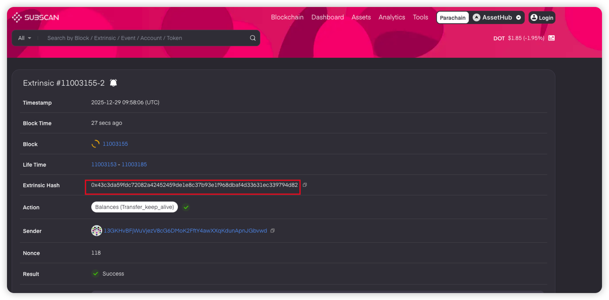
  We can see that this transaction has been confirmed on-chain and is visible on subscan, test passed.

##### 2. Transfer Multi-Asset
  input:
  ```
  ransfer 1 DOTA to address 15DBKxnn69eo4pYZQbD8geFXFQDC2qC51qhvBEKgEYviahit
  ```
  output:
  ```
  Transfer Asset 18 to 15DBKxnn69eo4pYZQbD8geFXFQDC2qC51qhvBEKgEYviahit successfully.
  Tx's id: 0xdbef006350ab62d2bca01692a312bfba5bbbb10193c821ac6f6d36a7f9562edc
  Extrinsic URL: https://assethub-polkadot.subscan.io/extrinsic/0xdbef006350ab62d2bca01692a312bfba5bbbb10193c821ac6f6d36a7f9562edc
  ```
  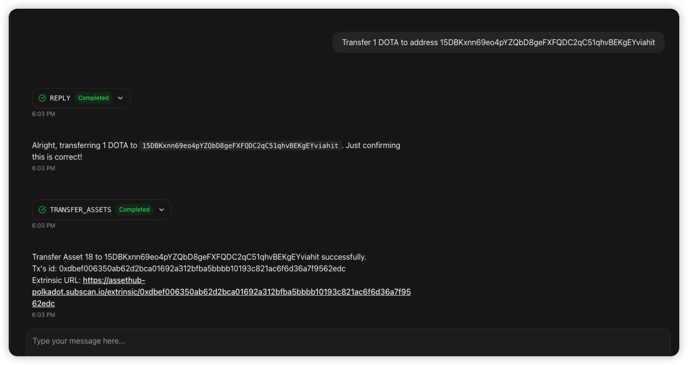
  [https://assethub-polkadot.subscan.io/extrinsic/0xdbef006350ab62d2bca01692a312bfba5bbbb10193c821ac6f6d36a7f9562edc](https://assethub-polkadot.subscan.io/extrinsic/0xdbef006350ab62d2bca01692a312bfba5bbbb10193c821ac6f6d36a7f9562edc) 
  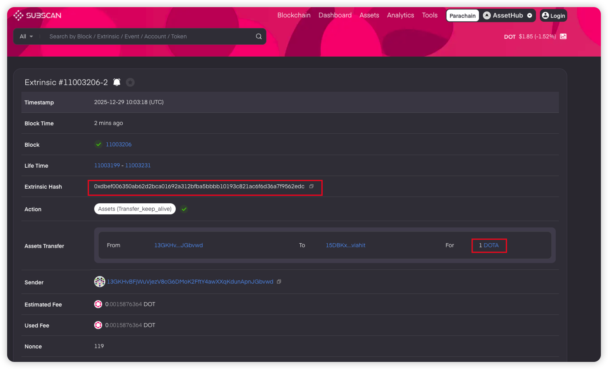
  This transaction was successful and can be queried on subscan, test passed.

#### 4. SEND_MESSAGE_WITH_NO_TRANSFER (send-message.ts)
input:
```
Send the message "Hello, nice to meet you!" to address 15DBKxnn69eo4pYZQbD8geFXFQDC2qC51qhvBEKgEYviahit
```
output:
```
Send message 'Hello, nice to meet you!' to 15DBKxnn69eo4pYZQbD8geFXFQDC2qC51qhvBEKgEYviahit successfully.
Tx's id: 0xfe578930c93064349ea1481da666483b81cc86aab59ac67011e63841c67bf3fa
Extrinsic URL: https://assethub-polkadot.subscan.io/extrinsic/0xfe578930c93064349ea1481da666483b81cc86aab59ac67011e63841c67bf3fa

```
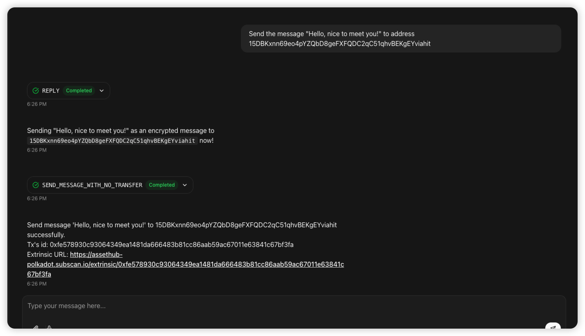
[https://assethub-polkadot.subscan.io/extrinsic/0xfe578930c93064349ea1481da666483b81cc86aab59ac67011e63841c67bf3fa](https://assethub-polkadot.subscan.io/extrinsic/0xfe578930c93064349ea1481da666483b81cc86aab59ac67011e63841c67bf3fa)
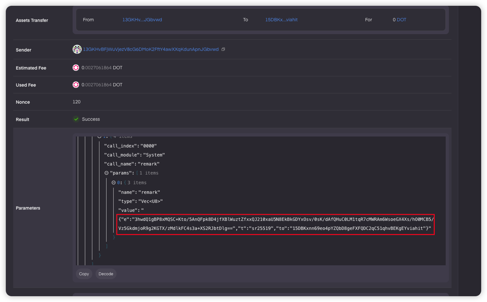
We can see that the message has been sent on-chain and is encrypted, contained in the e field. Test passed.

#### 5. GET_TRANSFER_DETAIL_BY_HASH (get_transfer_detail_by_hash.ts)

##### 1. Valid Transaction
Here, we retrieve the detailed information of the transaction from the previous step.

input:
```
Show transaction 0xfe578930c93064349ea1481da666483b81cc86aab59ac67011e63841c67bf3fa details
```
output:
```
Get transfer detail by hash on the POLKADOT AssetHub successfully.
Detail:
Sender: 13GKHvBFjWuVjezV8cG6DMoK2FftY4awXXqKdunApnJGbvwd
Recipient: 15DBKxnn69eo4pYZQbD8geFXFQDC2qC51qhvBEKgEYviahit
Token: DOT
Amount: 0
Fee: 0.0027061864 DOT
Memo: Hello, nice to meet you!
Time: 12/29/2025, 6:26:36 PM
TxId: 0xfe578930c93064349ea1481da666483b81cc86aab59ac67011e63841c67bf3fa
Extrinsic URL: https://assethub-polkadot.subscan.io/extrinsic/11003435-2
```
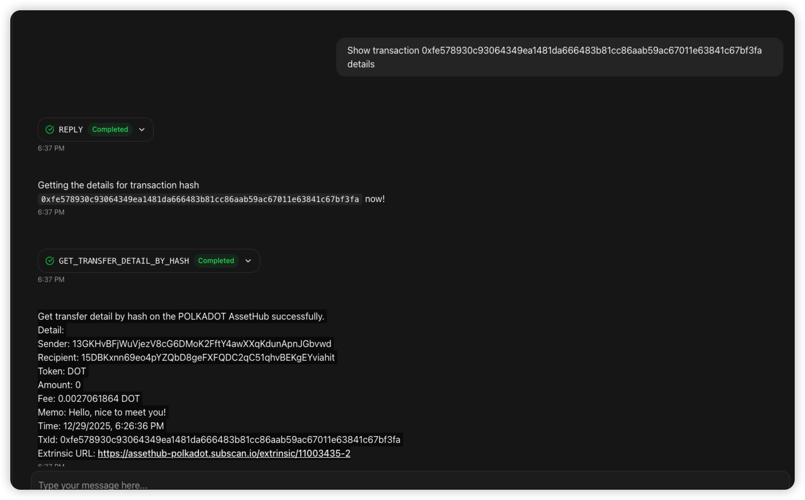
Here, we have successfully queried the encrypted transaction from step 4 and decrypted the encrypted message. Test passed.

##### 2. Invalid Transaction (Not on-chain)
Here, we try to query a transaction that does not exist on-chain.
input:
```
Get transaction 0xdbef006350ab62d2bca01692a312bfba5bbbb10193c821ac6f6d36a7f9562edd detail
```
output:
```
Failed to get transfer detail by hash on the POLKADOT AssetHub. error: TypeError: null is not an object (evaluating '(await (await fetch(url, options)).json()).data.extrinsic_index')
```
The invalid transaction throws an error as expected. Test passed.

#### 6. MY_WALLET_HISTORY (my-wallet-history.ts)

input:
```
Get my wallet history
```
output:
```
Get my wallet history on the Polkadot AssetHub successfully.
History:

Type: Send
Sender: 13GKHvBFjWuVjezV8cG6DMoK2FftY4awXXqKdunApnJGbvwd
Recipient: 15DBKxnn69eo4pYZQbD8geFXFQDC2qC51qhvBEKgEYviahit
Token: DOT
Amount: 0
Memo: Hello, nice to meet you!
Time: 12/29/2025, 6:26:36 PM
TxId: 0xfe578930c93064349ea1481da666483b81cc86aab59ac67011e63841c67bf3fa
Extrinsic URL: https://assethub-polkadot.subscan.io/extrinsic/11003435-2
Type: Send
Sender: 13GKHvBFjWuVjezV8cG6DMoK2FftY4awXXqKdunApnJGbvwd
Recipient: 15DBKxnn69eo4pYZQbD8geFXFQDC2qC51qhvBEKgEYviahit
Token: DOTA
Amount: 1
Memo:

Time: 12/29/2025, 6:03:18 PM
TxId: 0xdbef006350ab62d2bca01692a312bfba5bbbb10193c821ac6f6d36a7f9562edc
Extrinsic URL: https://assethub-polkadot.subscan.io/extrinsic/11003206-2
Type: Send
Sender: 13GKHvBFjWuVjezV8cG6DMoK2FftY4awXXqKdunApnJGbvwd
Recipient: 15DBKxnn69eo4pYZQbD8geFXFQDC2qC51qhvBEKgEYviahit
Token: DOT
Amount: 0.01
Memo:

Time: 12/29/2025, 5:58:06 PM
TxId: 0x43c3da59fdc72082a42452459de1e8c37b93e1f968dbaf4d33631ec339794d82
Extrinsic URL: https://assethub-polkadot.subscan.io/extrinsic/11003155-2
```image.png
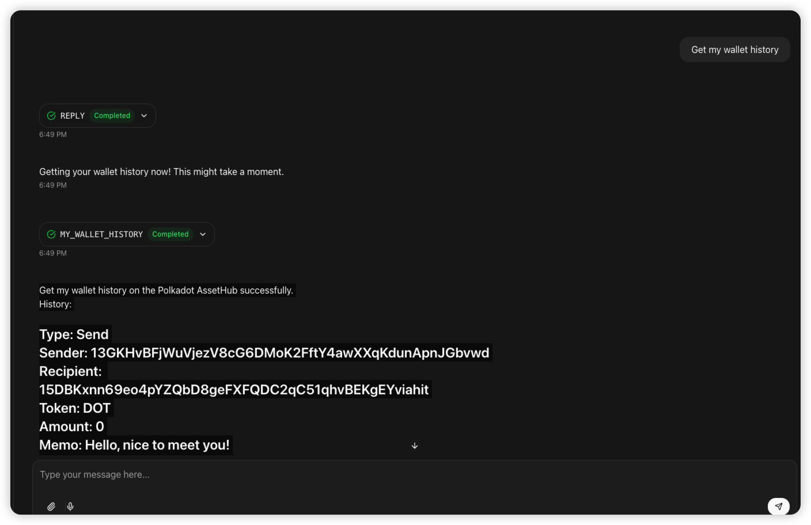

Here, we can see all the transactions we sent above, and the memo has been decrypted. Test passed.

